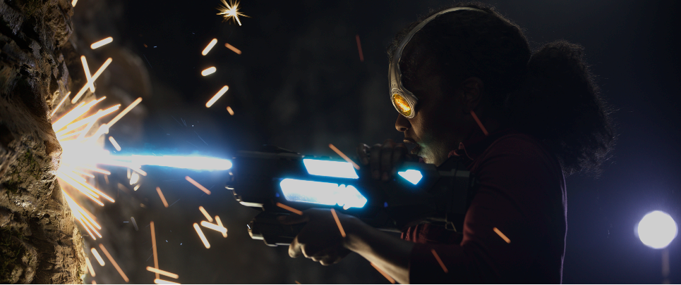
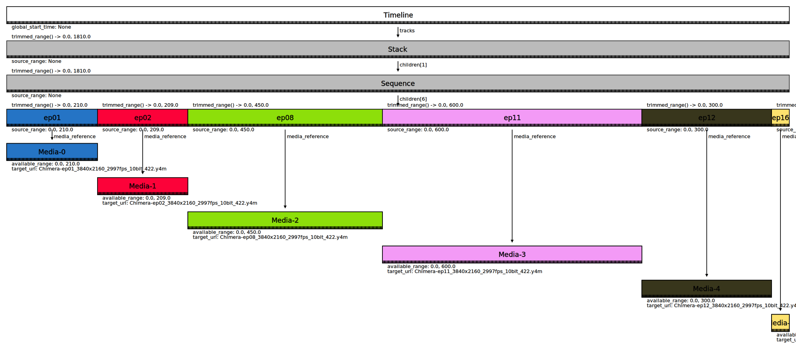
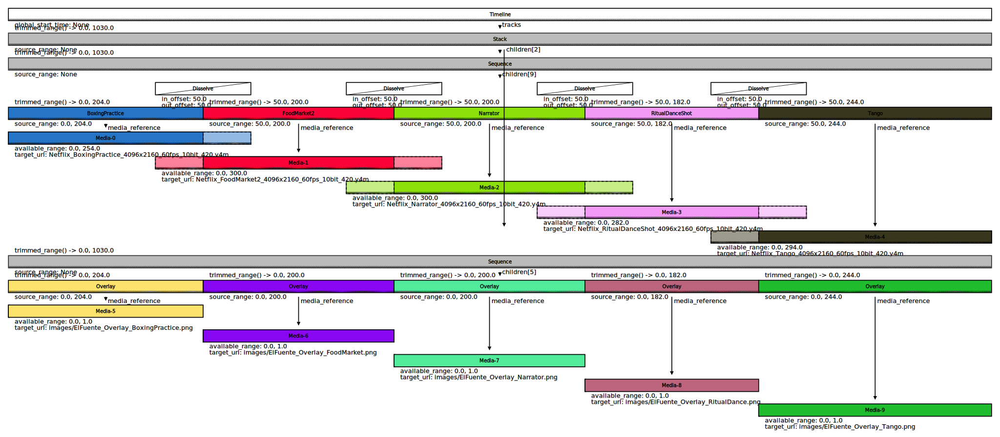

OpenTimelineIO Open Content Examples
====================================
Example [OpenTimelineIO](https://github.com/PixarAnimationStudios/OpenTimelineIO) files with
production quality source footage.

Useful for testing OpenTimelineIO based applications, especially viewers and playback
applications.

Source footage consists of a number of different formats, frame rates, and resolutions.
Including movie files (H264, ProRes), image sequences (EXR, TIFF), high frame rates
(50.94, 60), high resolutions (4096x2160, 3840x2160), and high dynamic range (10-bit,
16-bit float).

ASC footage is provided under the license found on this page:
https://dpel.aswf.io/asc-stem2/

Netflix footage is licensed under the Creative Commons Attribution 4.0 International
Public License:
https://opencontent.netflix.com/

Netflix source footage is hosted on AWS and can be downloaded directly with a web browser or
with the AWS command line interface:
https://docs.aws.amazon.com/cli/latest/userguide/cli-chap-install.html


ASC StEM2 (2022)
================


198 clips @ 24FPS

### 4096x1716 EXR file sequence (1.2 TB):
[STEM2_4k_ctm_ACES_239.otio](https://github.com/darbyjohnston/otio-oc-examples/blob/main/STEM2_4k_ctm_ACES_239.otio)
https://aswf-dpel-assets.s3.amazonaws.com/asc-stem2/EXR/mission_StEM2_EXR_239_4096x1716.zip

The .wav file referenced in the .otio file can be extracted from a movie file with FFmpeg:
https://aswf-dpel-assets.s3.amazonaws.com/asc-stem2/ASC_StEM2_178_UHD_ST2084_1000nits_Rec2020_Stereo_ProRes4444XQ.mov
```
ffmpeg -i ASC_StEM2_178_UHD_ST2084_1000nits_Rec2020_Stereo_ProRes4444XQ.mov ASC_StEM2_178_UHD_ST2084_1000nits_Rec2020_Stereo_ProRes4444XQ.wav
```


Sol Levante (2020)
==================


72 clips @ 24FPS

### 3840x2160 ProRes movie file (35 GB):
[SolLevante_HDR10_r2020_ST2084_UHD_24fps_1000nit.otio](https://github.com/darbyjohnston/otio-oc-examples/blob/main/SolLevante_HDR10_r2020_ST2084_UHD_24fps_1000nit.otio)
```
aws s3 cp --no-sign-request s3://download.opencontent.netflix.com/SolLevante/hdr10/SolLevante_HDR10_r2020_ST2084_UHD_24fps_1000nit.mov .
```
The original editorial file ```sollevante_lp_16b_hdr_p3d65pq_dolbyvision29.xml``` was
converted to .otio with ```SolLevante_HDR10_r2020_ST2084_UHD_24fps_1000nit.py```.

### 3840x2160 16-bit TIFF file sequence (144 GB):
[sollevante_lp_vdm_16b_p3d65_pq_20200218_3840x2160.otio](https://github.com/darbyjohnston/otio-oc-examples/blob/main/sollevante_lp_vdm_16b_p3d65_pq_20200218_3840x2160.otio)
```
aws s3 cp --no-sign-request s3://download.opencontent.netflix.com/SolLevante/vdm/sollevante_lp_vdm_16b_p3d65_pq_20200218_3840x2160.zip .
```
The original editorial file ```sollevante_lp_16b_hdr_p3d65pq_dolbyvision29.xml``` was
converted to .otio with ```sollevante_lp_vdm_16b_p3d65_pq_20200218_3840x2160.py```.

### 1920x1080 H264 movie file (320 MB):
[SolLevante_Animatics_ver1_H264.otio](https://github.com/darbyjohnston/otio-oc-examples/blob/main/SolLevante_Animatics_ver1_H264.otio)
```
aws s3 cp --no-sign-request s3://download.opencontent.netflix.com/SolLevante/working_assets/SolLevante_Animatics_ver1_H264.mov .
```


Sparks (2017)
=============


39 clips @ 59.94 FPS

### 4096x2160 16-bit float EXR sequence (681 GB):
[SPARKS_P3_PQ_4000nit.otio](https://github.com/darbyjohnston/otio-oc-examples/blob/main/SPARKS_P3_PQ_4000nit.otio)
```
aws s3 sync --no-sign-request s3://download.opencontent.netflix.com/sparks/SPARKS_4K_P3_PQ_4000nits_EXR .
```
The original editorial file ```20161103_SPARKS_DOVI_METADATA_AR_CORRECT.xml``` was
converted to .otio with ```SPARKS_P3_PQ_4000nit.py```.

### 4096x2160 16-bit TIFF sequence (681 GB):
[SPARKS_HDR10_4K_2020_PQ_1000nits.otio](https://github.com/darbyjohnston/otio-oc-examples/blob/main/SPARKS_HDR10_4K_2020_PQ_1000nits.otio)
To download the content (681 GB):
```
aws s3 sync --no-sign-request s3://download.opencontent.netflix.com/sparks/HDR10_1000nit_PQ_2020_image_sequence .
```
The original editorial file ```20161103_SPARKS_DOVI_METADATA_AR_CORRECT.xml``` was
converted to .otio with ```SPARKS_HDR10_4K_2020_PQ_1000nits.py```.


Meridian (2016)
===============


83 clips @ 59.94 FPS

### 3840x2160 H264 movie file (811 MB):
[Meridian_UHD4k5994_HDR_P3PQ.otio](https://github.com/darbyjohnston/otio-oc-examples/blob/main/Meridian_UHD4k5994_HDR_P3PQ.otio)
```
aws s3 cp --no-sign-request s3://download.opencontent.netflix.com/Meridian/Meridian_UHD4k5994_HDR_P3PQ.mp4 .
```


Chimera (2014)
==============


6 clips @ 29.97 FPS

### 3840x2160 YUB movie files (79 GB):
[Chimera_3840x2160_2997fps_10bit_422.otio](https://github.com/darbyjohnston/otio-oc-examples/blob/main/Chimera_3840x2160_2997fps_10bit_422.otio)
```
aws s3 sync --no-sign-request s3://download.opencontent.netflix.com/aom_test_materials/Chimera .
```




El Fuente (2013)
================


5 clips @ 60 FPS

### 4096x2160 YUV movie files (35 GB):
[ElFuente_4096x2160_60fps_10bit_420.otio](https://github.com/darbyjohnston/otio-oc-examples/blob/main/ElFuente_4096x2160_60fps_10bit_420.otio)
```
aws s3 sync --no-sign-request s3://download.opencontent.netflix.com/aom_test_materials/ElFuente .
```

Alternate version with dissolves and a second video track that overlays a title image:
[ElFuente_4096x2160_60fps_10bit_420_remix1.otio](https://github.com/darbyjohnston/otio-oc-examples/blob/main/ElFuente_4096x2160_60fps_10bit_420_remix1.otio)


