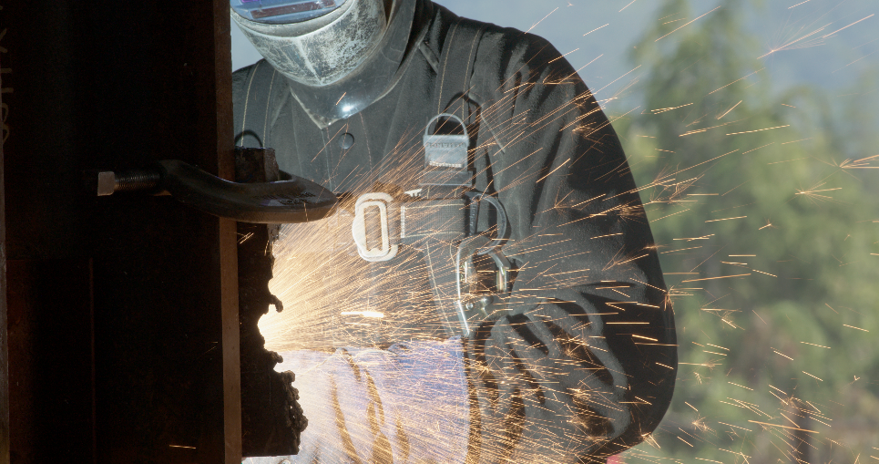

OpenTimelineIO Open Content Examples
====================================
This repository contains example files for use with
[OpenTimelineIO](https://github.com/PixarAnimationStudios/OpenTimelineIO) applications.

The examples are based on open source content from [Netflix](https://opencontent.netflix.com/).
The content is provided under the terms of this [license](https://creativecommons.org/licenses/by/4.0/legalcode).

The content can be downloaded with the AWS Command Line Interface, documentation
is available [here](https://docs.aws.amazon.com/cli/latest/userguide/cli-chap-install.html).

<br />
Sol Levante (2020)
==================


### [SolLevante_HDR10_r2020_ST2084_UHD_24fps_1000nit.otio](https://github.com/darbyjohnston/otio-oc-examples/blob/main/SolLevante_HDR10_r2020_ST2084_UHD_24fps_1000nit.otio)

This .otio file consists of 72 clips with a 3840x2160 ProRes movie file for source footage.

To download the content (34.8 GB):
```
aws s3 cp --no-sign-request s3://download.opencontent.netflix.com/SolLevante/hdr10/SolLevante_HDR10_r2020_ST2084_UHD_24fps_1000nit.mov .
```

The original editorial file ```sollevante_lp_16b_hdr_p3d65pq_dolbyvision29.xml``` was
converted to .otio with ```SolLevante_HDR10_r2020_ST2084_UHD_24fps_1000nit.py```.


### [sollevante_lp_vdm_16b_p3d65_pq_20200218_3840x2160.otio](https://github.com/darbyjohnston/otio-oc-examples/blob/main/sollevante_lp_vdm_16b_p3d65_pq_20200218_3840x2160.otio)

This .otio file consists of 72 clips with a 3840x2160 16-bit TIFF file sequence for source footage.

To download the content (144 GB):
```
aws s3 cp --no-sign-request s3://download.opencontent.netflix.com/SolLevante/vdm/sollevante_lp_vdm_16b_p3d65_pq_20200218_3840x2160.zip .
```

The original editorial file ```sollevante_lp_16b_hdr_p3d65pq_dolbyvision29.xml``` was
converted to .otio with ```sollevante_lp_vdm_16b_p3d65_pq_20200218_3840x2160.py```.

### [SolLevante_Animatics_ver1_H264.otio](https://github.com/darbyjohnston/otio-oc-examples/blob/main/SolLevante_Animatics_ver1_H264.otio)

This .otio file consists of 63 clips with a 1920x1080 H264 movie file for source footage.

To download the content (320 MB):
```
aws s3 cp --no-sign-request s3://download.opencontent.netflix.com/SolLevante/working_assets/SolLevante_Animatics_ver1_H264.mov .
```


Sparks (2017)
=============


### [SPARKS_P3_PQ_4000nit.otio](https://github.com/darbyjohnston/otio-oc-examples/blob/main/SPARKS_P3_PQ_4000nit.otio)

This .otio file contains 39 clips with a 4096x2160 16-bit float EXR file sequence for source footage.

To download the content (681 GB):
```
aws s3 sync --no-sign-request s3://download.opencontent.netflix.com/sparks/SPARKS_4K_P3_PQ_4000nits_EXR .
```

The original editorial file ```20161103_SPARKS_DOVI_METADATA_AR_CORRECT.xml``` was
converted to .otio with ```SPARKS_P3_PQ_4000nit.py```.

### [SPARKS_HDR10_4K_2020_PQ_1000nits.otio](https://github.com/darbyjohnston/otio-oc-examples/blob/main/SPARKS_HDR10_4K_2020_PQ_1000nits.otio)

This .otio file contains 39 clips with a 4096x2160 16-bit TIFF file sequence for source footage.

To download the content (681 GB):
```
aws s3 sync --no-sign-request s3://download.opencontent.netflix.com/sparks/HDR10_1000nit_PQ_2020_image_sequence .
```

The original editorial file ```20161103_SPARKS_DOVI_METADATA_AR_CORRECT.xml``` was
converted to .otio with ```SPARKS_HDR10_4K_2020_PQ_1000nits.py```.


Meridian (2016)
===============


### [Meridian_UHD4k5994_HDR_P3PQ.otio](https://github.com/darbyjohnston/otio-oc-examples/blob/main/Meridian_UHD4k5994_HDR_P3PQ.otio)

This .otio file contains 83 clips with a 3840x2160 H264 movie file for source footage.

To download the content (811 MB):
```
aws s3 sync --no-sign-request s3://download.opencontent.netflix.com/Meridian/Meridian_UHD4k5994_HDR_P3PQ.mp4 .
```


Chimera (2014)
==============


### [Chimera_3840x2160_2997fps_10bit_422.otio](https://github.com/darbyjohnston/otio-oc-examples/blob/main/Chimera_3840x2160_2997fps_10bit_422.otio)

This .otio file contains 6 clips with multiple 4096x2160 YUV movie files for source footage.

To download the content (79.4 GB):
```
aws s3 sync --no-sign-request s3://download.opencontent.netflix.com/aom_test_materials/Chimera .
```


El Fuente (2013)
================


### [ElFuente_4096x2160_60fps_10bit_420.otio](https://github.com/darbyjohnston/otio-oc-examples/blob/main/ElFuente_4096x2160_60fps_10bit_420.otio)

This .otio file contains 5 clips with multiple 4096x2160 YUV movie filess for source footage.

To download the content (35.3 GB):
```
aws s3 sync --no-sign-request s3://download.opencontent.netflix.com/aom_test_materials/ElFuente .
```
