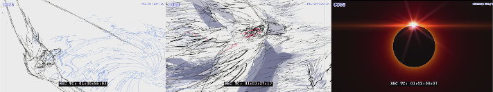

OpenTimelineIO Open Content Examples
====================================
This repository contains example files for use with OpenTimelineIO
(https://github.com/PixarAnimationStudios/OpenTimelineIO) applications.

The examples are based on open source content from Netflix:
https://opencontent.netflix.com/
https://creativecommons.org/licenses/by/4.0/legalcode

Documentation on using the AWS Command Line Interface for downloading the content:
https://docs.aws.amazon.com/cli/latest/userguide/cli-chap-install.html


Sol Levante (2020)
------------------
An animated short film from Netflix.




### SolLevante_HDR10_r2020_ST2084_UHD_24fps_1000nit.otio

This .otio file consists of 72 clips using a 3840x2160 ProRes movie for source footage.

Downloading the content (34.8 GB):
```
aws s3 cp --no-sign-request s3://download.opencontent.netflix.com/SolLevante/hdr10/SolLevante_HDR10_r2020_ST2084_UHD_24fps_1000nit.mov .
```

The original editorial file ```sollevante_lp_16b_hdr_p3d65pq_dolbyvision29.xml``` was
converted to .otio with ```SolLevante_HDR10_r2020_ST2084_UHD_24fps_1000nit.py```.


### sollevante_lp_vdm_16b_p3d65_pq_20200218_3840x2160.otio

This .otio file consists of 72 clips using a 3840x2160 16-bit TIFF sequence for source footage.

Downloading the content (144 GB):
```
aws s3 cp --no-sign-request s3://download.opencontent.netflix.com/SolLevante/vdm/sollevante_lp_vdm_16b_p3d65_pq_20200218_3840x2160.zip .
```

The original editorial file ```sollevante_lp_16b_hdr_p3d65pq_dolbyvision29.xml``` was
converted to .otio with ```sollevante_lp_vdm_16b_p3d65_pq_20200218_3840x2160.py```.

### SolLevante_Animatics_ver1_H264.otio

This .otio file consists of 63 clips using a 1920x1080 H264 movie for source footage.

Downloading the content (320MB):
```
aws s3 cp --no-sign-request s3://download.opencontent.netflix.com/SolLevante/working_assets/SolLevante_Animatics_ver1_H264.mov .
```


Sparks (2017)
-------------
A high dynamic range test film from Netflix.


### SPARKS_P3_PQ_4000nit.otio

This .otio file contains 39 clips using a 4096x2160 16-bit float EXR sequence for source footage.

Downloading the content (681 GB):
```
aws s3 sync --no-sign-request s3://download.opencontent.netflix.com/sparks/SPARKS_4K_P3_PQ_4000nits_EXR .
```

The original editorial file ```20161103_SPARKS_DOVI_METADATA_AR_CORRECT.xml``` was
converted to .otio with ```SPARKS_P3_PQ_4000nit.py```.

### SPARKS_HDR10_4K_2020_PQ_1000nits.otio

This .otio file contains 39 clips using a 4096x2160 16-bit TIFF sequence for source footage.

Downloading the content (681 GB):
```
aws s3 sync --no-sign-request s3://download.opencontent.netflix.com/sparks/HDR10_1000nit_PQ_2020_image_sequence .
```

The original editorial file ```20161103_SPARKS_DOVI_METADATA_AR_CORRECT.xml``` was
converted to .otio with ```SPARKS_HDR10_4K_2020_PQ_1000nits.py```.
